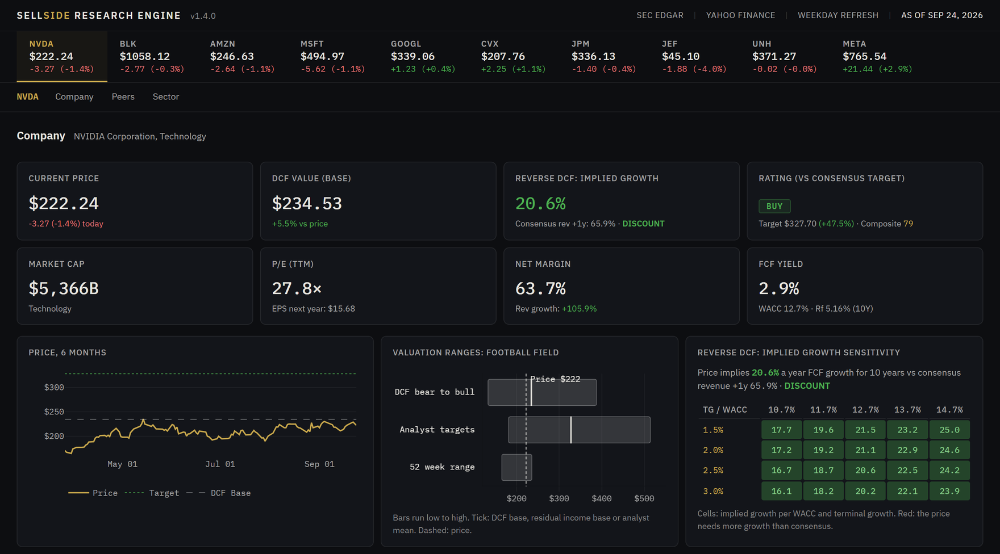
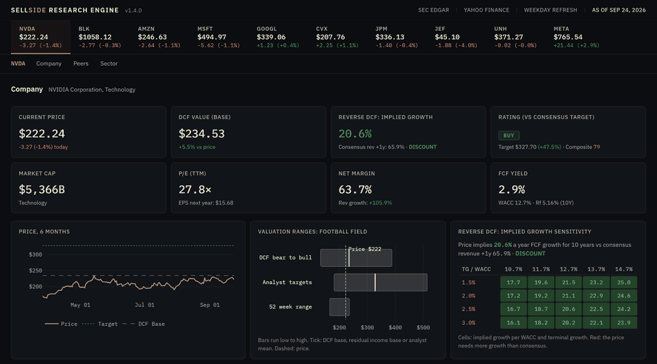
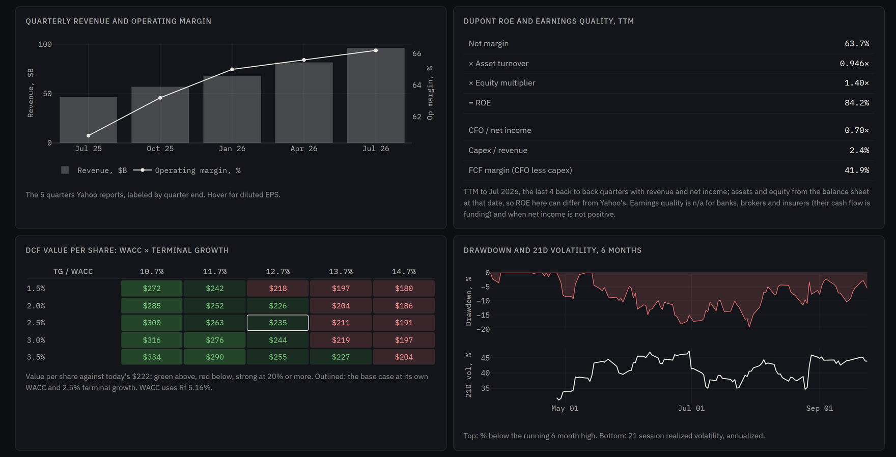
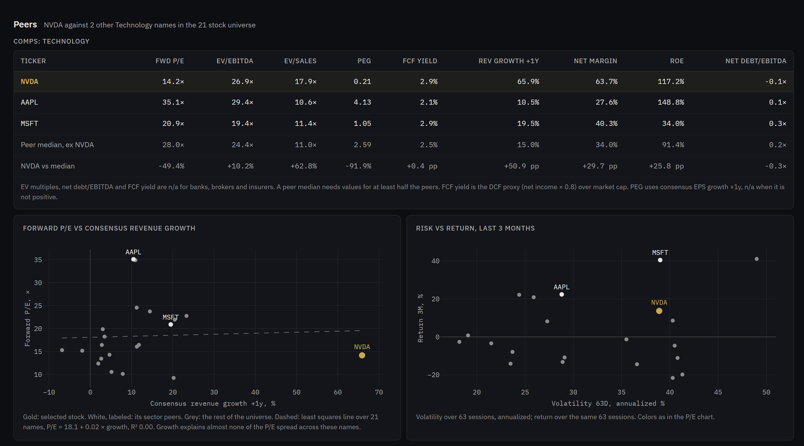
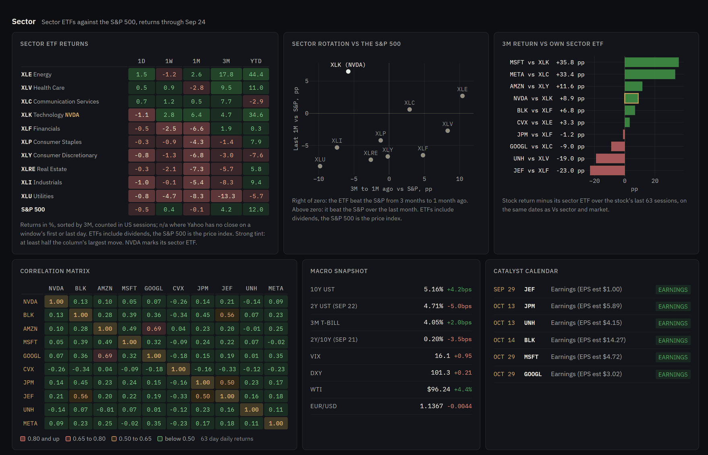
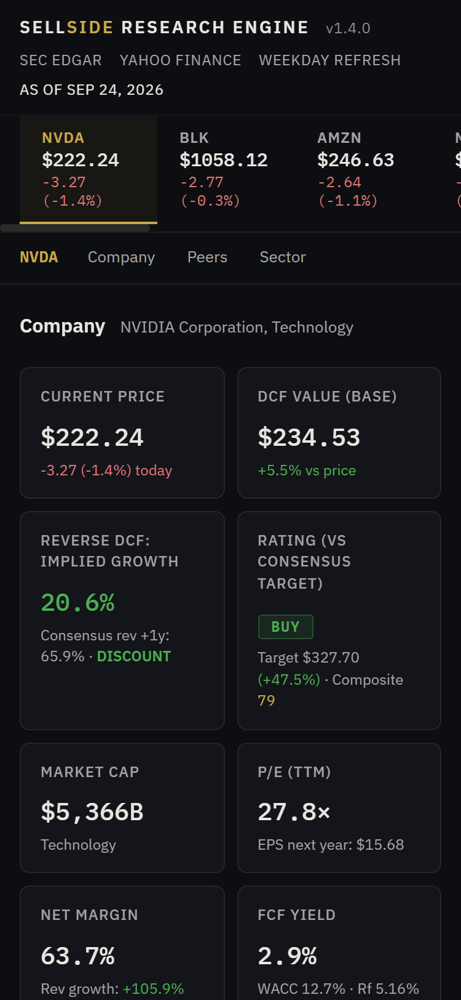
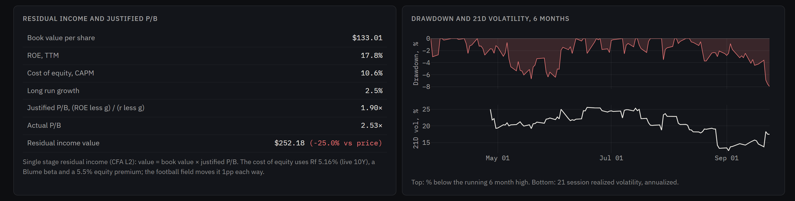
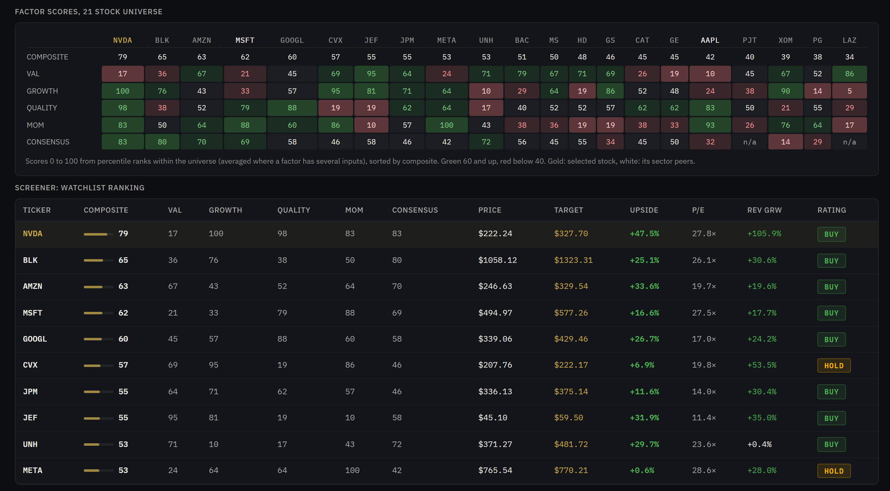
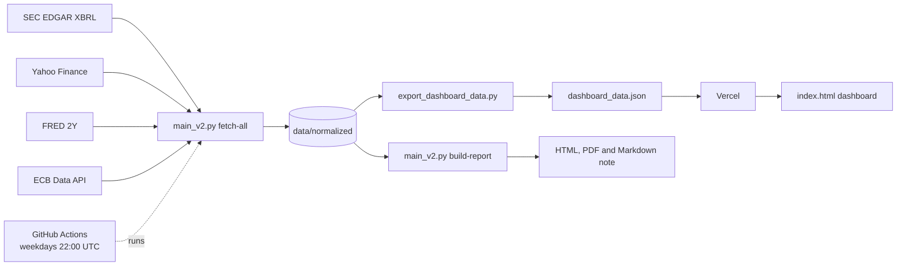

<h1 align="center">Sellside Research Engine</h1>

<p align="center">
  <b>Open source equity research dashboard and Python pipeline.</b><br/>
  DCF, reverse DCF, residual income, peer comps, factor screening and risk analytics on live SEC EDGAR, Yahoo Finance, FRED and ECB data, refreshed every weekday.
</p>

<p align="center">
  <a href="https://sellside-research-engine.vercel.app"></a>
  <a href="https://github.com/DogInfantry/sellside-research-engine/actions/workflows/refresh-data.yml"></a>
  <a href="https://github.com/DogInfantry/sellside-research-engine/releases"></a>
  
  <a href="LICENSE"></a>
</p>

<p align="center">
  <a href="https://sellside-research-engine.vercel.app"><b>Live dashboard</b></a> ·
  <a href="#dashboard-tour">Tour</a> ·
  <a href="#quick-start">Quick start</a> ·
  <a href="#how-it-works">How it works</a> ·
  <a href="#faq">FAQ</a>
</p>

<p align="center">
  <a href="https://sellside-research-engine.vercel.app"></a>
</p>

> [!NOTE]
> A research and education tool, not investment advice. Every number comes from a public source and anything missing shows as n/a. The few model defaults (5% growth, 5.3% risk free fallback, beta 1.0) are listed under Methodology.

## What it is

**Sellside Research Engine** is an open source Python pipeline and web dashboard that automates the core sell side analyst loop. It pulls audited fundamentals from SEC EDGAR, prices and consensus estimates from Yahoo Finance and rates from Yahoo Finance, FRED and the ECB. It screens 21 US stocks, values the top 10 with a DCF, a reverse DCF or residual income, and publishes the result to a static dashboard that GitHub Actions refreshes every weekday.

| At a glance | |
|---|---|
| **Universe** | 21 US stocks in 8 sectors (`DEFAULT_US_TICKERS` in `trg_workbench/config.py`) |
| **Dashboard** | Top 10 by research score, re-ranked on every refresh; comps, factors and scatters cover all 21 |
| **Valuation** | Bear/base/bull FCF DCF, reverse DCF (the growth the price implies), residual income and justified P/B for banks and brokers, football field, peer multiples |
| **Risk** | VaR and CVaR (95%, 1 day), volatility, beta vs the S&P 500, Sharpe, Sortino, max drawdown, correlation matrix |
| **Sentiment** | EPS revisions, earnings surprises, recommendation trend, short interest, insider activity |
| **Sector and macro** | 10 SPDR sector ETFs vs the S&P 500, rotation view, live 10Y, 2Y, 3M bill, VIX, DXY, WTI, EUR/USD |
| **Data** | SEC EDGAR XBRL, Yahoo Finance, FRED, ECB. No API keys needed |
| **Refresh** | Weekdays at 22:00 UTC via GitHub Actions; each data commit redeploys on Vercel |
| **Stack** | Python 3.12, pandas, scipy, yfinance; vanilla JS, Chart.js, Plotly; Vercel static hosting |
| **License** | Apache 2.0 |

## Dashboard tour

<p align="center">
  
</p>

Screenshots of the [live dashboard](https://sellside-research-engine.vercel.app), data as of 2026-09-24.

### Company



- 8 KPI tiles, a 6 month price chart, a football field of real ranges (DCF bear to bull or residual income, analyst targets, 52 week range) and a reverse DCF grid
- Relative performance vs the stock's sector ETF and the S&P 500, factor radar and risk metrics
- Reported quarters, TTM DuPont, earnings quality, the DCF value grid, drawdown, estimate revisions, surprises, ratings and positioning

### Peers



- Comps table: forward P/E, EV/EBITDA, EV/Sales, PEG, FCF yield, growth, margin, ROE and net debt/EBITDA vs the sector peer median
- Forward P/E vs consensus revenue growth with a least squares line, and risk vs return for the whole universe

### Sector



- Sector ETF returns from 1D to YTD next to the S&P 500, a rotation view and each stock's 3M return vs its own ETF
- Correlation matrix, macro snapshot with live rates, and upcoming earnings dates

### On mobile

<p align="center">
  
</p>

<details>
<summary><b>More: bank valuation (JPM), factor heatmap and screener</b></summary>

<br/>



</details>

## Quick start

```bash
git clone https://github.com/DogInfantry/sellside-research-engine.git && cd sellside-research-engine
pip install -r requirements.txt     # Python 3.12
python export_dashboard_data.py     # fetch live data, write dashboard_data.json
python -m http.server 8000          # open http://localhost:8000
```

<details>
<summary><b>Research note, CLI options, Windows and deploying your own copy</b></summary>

<br/>

**Virtual environment and SEC contact.** Use a venv (`python -m venv .venv`, then `source .venv/bin/activate` or `.venv\Scripts\activate` on Windows). SEC asks API users for contact details: `export SEC_USER_AGENT="Your Name you@example.com"` (PowerShell: `$env:SEC_USER_AGENT="Your Name you@example.com"`). Without it a generic agent is used.

**Research note.** `python main_v2.py build-all --as-of 2026-09-24` fetches data and writes the HTML note, PDF and Markdown note to `outputs/`. Options: `--dry-run` checks the date, `SEC_USER_AGENT`, the output dir and the WeasyPrint/Plotly installs without fetching; `--quiet` hides progress bars; `--formats html,pdf,markdown` picks outputs. Without WeasyPrint the PDF falls back to HTML.

**Two step dashboard build.** `python main_v2.py fetch-all --as-of D` then `python export_dashboard_data.py --as-of D --skip-fetch`. `--as-of` defaults to today.

**Deploy your own copy.**
1. Fork the repo.
2. Import the fork in Vercel. `vercel.json` makes it a static site with no build step.
3. Enable Actions in the fork so `refresh-data.yml` commits fresh data every weekday (an optional `SEC_USER_AGENT` secret is used when set).

Forks and redistributions must keep the [NOTICE](NOTICE) file and credit the original repository.

</details>

## How it works



- **One valuation path.** `trg_workbench/pipeline_v2.py::value_ticker()` (FCF DCF) and `value_bank()` (residual income) feed both the research note and the dashboard with the same live risk free rate.
- **Refresh and deploy.** The weekday workflow fetches, exports, validates the JSON and commits `dashboard_data.json` as `github-actions[bot]` only when it changed. The Vercel Git integration deploys every push to `main` and a preview for every PR.

<details>
<summary><b>File map</b></summary>

<br/>

| Path | Role |
|---|---|
| `main_v2.py` | CLI: `fetch-all`, `build-report`, `build-all`, `--dry-run`, `--quiet` |
| `main.py` | v1 CLI: `fetch-data`, `build-daily`, `build-weekly`, `build-kpis`, `build-all`, analyst overlays |
| `trg_workbench/pipeline_v2.py` | Orchestration: `fetch_data_v2`, `value_ticker`, `value_bank`, `build_research_report_v2` |
| `trg_workbench/pipeline.py` | v1 fetch (market, SEC, ECB), called by v2 |
| `trg_workbench/analytics/screening.py` | `build_research_dataset` (factor scores, analyst targets, earnings dates), `top_screen_candidates` |
| `trg_workbench/analytics/valuation.py` | WACC, DCF scenarios, value grid, reverse DCF, football field, `build_comps_table`, `residual_income_value` |
| `trg_workbench/analytics/risk.py` | Vol, beta, Sharpe, Sortino, drawdown, VaR/CVaR |
| `trg_workbench/analytics/summaries.py` | Catalyst calendar and report summaries |
| `trg_workbench/sources/` | Yahoo market data (`fetch_quarterly`, `fetch_sentiment`), SEC, ECB, US macro (Yahoo plus FRED) |
| `trg_workbench/llm/` | Transcript fetch and keyword heuristic commentary (no LLM calls) |
| `trg_workbench/reporting/` | Charts, HTML/PDF/Markdown renderers, Jinja templates |
| `export_dashboard_data.py` | Builds `dashboard_data.json` |
| `index.html` | Dashboard (single file, JSON loaded at runtime) |
| `vercel.json` | Static build: `index.html`, `dashboard_data.json`, `robots.txt`, `sitemap.xml`, `llms.txt`, preview image |
| `.github/workflows/refresh-data.yml` | Weekday data refresh |
| `tests/` | pytest suite |

</details>

## Methodology

<details>
<summary><b>Data sources</b></summary>

<br/>

| Source | What it provides |
|---|---|
| **SEC EDGAR XBRL** (`companyfacts`) | Audited revenue, net income, equity and assets from 10-K and 20-F filings |
| **Yahoo Finance** (yfinance) | Prices, security master (shares, debt, cash, beta, EV/EBITDA, book value, short interest), EPS and revenue estimates, price targets, recommendation trend, EPS trend and revisions, earnings history, insider summary, quarterly statements, earnings dates, 10 SPDR sector ETFs, 5 European indices |
| **US macro via Yahoo** | 10Y (`^TNX`), 30Y (`^TYX`), 3M bill (`^IRX`), VIX, DXY, WTI, gold, S&P 500 (`^GSPC`), Nasdaq 100 (`^NDX`) |
| **FRED** (`DGS2`, no key) | 2 year Treasury yield |
| **ECB Data API** | EUR/USD, GBP/EUR, deposit facility rate and main refinancing rate (the dashboard shows EUR/USD) |

Missing values are written as `null` (`allow_nan=False`) and render as n/a. Known gaps: FRED can lag Yahoo by a day (the macro card shows the date), and Yahoo drops single days per series, so every return window reads closes on exact dates and shows n/a when one is missing.

</details>

<details>
<summary><b>Screening model</b></summary>

<br/>

| Factor | Signals | Weight |
|---|---|---|
| **Valuation** | P/S, P/E, percentile ranked (lower is better) | 25% |
| **Growth** | Trailing YoY revenue growth (SEC) | 25% |
| **Quality** | Net margin, ROE | 25% |
| **Momentum** | 1M and 3M returns | 25% |

The composite is the equal weighted mean of the four factors. A forward view scores forward EPS growth, consensus target upside, the analyst buy ratio and its 3 month change. The research score averages the composite, forward and (v1 only) discretionary scores. The dashboard ranks by research score, then target upside, 1M return and market cap.

</details>

<details>
<summary><b>DCF, reverse DCF and residual income</b></summary>

<br/>

**FCF DCF**
- FCF proxy = SEC net income (Yahoo fallback) × 0.80
- WACC = E/V × (Rf + Blume adjusted β × 5.5%) + D/V × 6% × (1 less 21% tax), with D/E fixed at 0.30, rounded to 0.1pp. Rf is the live 10Y Treasury; 5.3% only if the macro fetch fails. Blume beta = 0.67 × Yahoo beta + 0.33 (Yahoo beta 1.0 when missing)
- Growth = consensus +1y revenue growth, trailing growth as fallback, 5% when neither exists, clamped to the range -20% to 50%
- 5 year explicit forecast with growth fading ×0.85 a year, then a Gordon terminal value
- Scenarios: Bear (growth × 0.7, TGR 1%, WACC +1pp, capped at 15%), Base (TGR 2.5%), Bull (growth × 1.3, TGR 3.5%, WACC -0.5pp, floored at 6%)
- Shares from the security master (`impliedSharesOutstanding`, all share classes)
- Dashboard only: a value grid of the ticker's own WACC ±2pp × terminal growth 1.5% to 3.5%, and the football field

**Reverse DCF**: solves for the constant 10 year FCF growth rate the current price implies. The note shows it at WACC ±100bps; the dashboard compares it with consensus +1y revenue growth (STRETCHED or DISCOUNT) over a WACC × terminal growth grid.

**Residual income**: banks, capital markets firms and insurers get no FCF DCF (their debt is operating). On the dashboard they get a single stage residual income value and justified P/B = (ROE less g) / (r less g) vs actual P/B, with g = 2.5% and a CAPM cost of equity. In the current universe that covers BAC, JPM, GS, JEF, LAZ, MS and PJT. The note skips these names.

**Rating**: mechanical, from consensus target upside. BUY above +10%, SELL below -10%, HOLD in between.

</details>

<details>
<summary><b>Risk metrics</b></summary>

<br/>

- Historical VaR and CVaR at 95%, 1 day, over 252 daily log returns
- Volatility (21D and 63D), max drawdown
- Beta: 63 day OLS vs the S&P 500 (WACC uses the Blume adjusted Yahoo beta instead)
- Sharpe and Sortino with the 3M T-bill as the risk free rate
- Correlation: Pearson on 63 days of daily returns on the dashboard, Spearman in the note heatmap

</details>

<details>
<summary><b>Management commentary (keyword heuristic, no LLM)</b></summary>

<br/>

Parses SEC 8-K earnings exhibits from a local cache (`data/cache/transcripts/TICKER_latest.txt`; set `TRG_FETCH_TRANSCRIPTS=1` to fetch from EDGAR when building the note). It outputs a keyword tone score, a Q&A tone label (constructive at 0.60 and up, cautious at 0.40 and below), one guidance sentence and up to 3 risk and 3 catalyst sentences. CI has no cached transcripts, so the live dashboard shows n/a for commentary.

</details>

<details>
<summary><b>Outputs</b></summary>

<br/>

- **Dashboard JSON**: `dashboard_data.json`, read by the live dashboard
- **HTML research note**: navy and gold template with 12 section slots; the v2 pipeline fills sector performance, risk (correlation heatmap), valuation (DCF scenarios and reverse DCF) and commentary when transcripts are cached
- **PDF**: WeasyPrint, with an HTML fallback
- **Markdown note**: sector 1 week moves, reverse DCF results and commentary
- **PNG charts** (150 DPI) in `outputs/charts/`

</details>

<details>
<summary><b>Customization and analyst overlays</b></summary>

<br/>

- **Universe**: edit `DEFAULT_US_TICKERS` in `trg_workbench/config.py`
- **Factor weights**: change the `.mean(axis=1)` in `build_research_dataset` (`trg_workbench/analytics/screening.py`)
- **DCF assumptions**: the `estimate_wacc` defaults and the scenario TGRs in `trg_workbench/analytics/valuation.py`
- **Analyst views** (v1 `main.py` reports only): copy `data/analyst_views_template.csv` to `data/analyst_views.csv`

| Column | Example | Description |
|---|---|---|
| `ticker` | `AAPL` | Matched case insensitively against the universe |
| `stance` | `Buy`, `Hold`, `Sell`, `Overweight`, `Underweight`, `Positive`, `Negative`, `Neutral` | Rating used in discretionary scoring |
| `conviction` | `1` to `5` | Normalized by dividing by 5 |
| `thesis` | `Services mix supports margin expansion` | Core thesis |
| `catalyst` | `June WWDC AI updates` | Near term catalyst |
| `risk` | `China demand weakness` | Key downside risk |
| `client_angle` | `High-quality mega-cap defensiveness` | Client framing |
| `management_access_note` | `Investor meetings requested after earnings` | Management access context |

</details>

<details>
<summary><b>Testing</b></summary>

<br/>

```bash
pytest -q
```

Covers SEC XBRL extraction, ECB normalization, screening, DCF inputs and scenarios, reverse DCF, residual income, comps and sector peer medians, the football field, exact date return windows, quarterly TTM and DuPont, sentiment, the dashboard JSON export, commentary extraction, templates and charts. There is no pytest CI yet ([#4](https://github.com/DogInfantry/sellside-research-engine/issues/4)).

</details>

## FAQ

### What is Sellside Research Engine?
An open source Python pipeline and static web dashboard that screens 21 US stocks and values the top 10 with a DCF, a reverse DCF or residual income, using only public data. The live dashboard is at [sellside-research-engine.vercel.app](https://sellside-research-engine.vercel.app).

### Where does the data come from?
Audited fundamentals from SEC EDGAR XBRL; prices, consensus estimates, price targets, quarterly statements and positioning from Yahoo Finance via yfinance; the 2 year Treasury from FRED (`DGS2`); EUR/USD from the ECB. Missing values stay `null` and show as n/a.

### How often is it refreshed?
Every weekday at 22:00 UTC a GitHub Actions workflow rebuilds `dashboard_data.json` and commits it only if the data changed; that commit triggers a Vercel deploy. The dashboard header shows the as of date.

### Which stocks does it cover?
AAPL, AMZN, BAC, BLK, CAT, CVX, GE, GOOGL, GS, HD, JEF, JPM, LAZ, META, MS, MSFT, NVDA, PJT, PG, UNH and XOM. The dashboard shows the top 10 by research score, so the list can change day to day; comps, the factor heatmap and the scatters cover all 21.

### How is fair value estimated?
A bear/base/bull FCF DCF with a 5 year fading forecast, a Gordon terminal value and a CAPM WACC on the live 10Y. A reverse DCF solves for the growth the price implies. Banks and capital markets firms get residual income and justified P/B instead.

### What do BUY, HOLD and SELL mean here?
They are mechanical: BUY when the consensus price target is more than 10% above the price, SELL when it is more than 10% below, HOLD otherwise. They are not recommendations.

### Does it use an LLM?
No. Management commentary is a keyword heuristic over SEC 8-K earnings exhibits, and it shows n/a on the live site because CI has no cached transcripts.

### Can I run or deploy my own copy?
Yes. See [Quick start](#quick-start): four commands run it locally, and a fork plus a Vercel import deploys it. The license is Apache 2.0; keep the NOTICE file and credit the original repository.

### Is this investment advice?
No. It is a research and education tool. Its outputs are model estimates from public data that can be delayed or missing.

## Roadmap

See the [Issues tab](https://github.com/DogInfantry/sellside-research-engine/issues) for specs and acceptance criteria.

- **Filings and estimates**: 10-K/10-Q intelligence ([#19](https://github.com/DogInfantry/sellside-research-engine/issues/19)); revision tracking and target drift ([#20](https://github.com/DogInfantry/sellside-research-engine/issues/20), revisions and surprises shipped in #62); Form 4 parser ([#25](https://github.com/DogInfantry/sellside-research-engine/issues/25), Yahoo insider summary shipped); FRED CPI, PCE and spreads ([#8](https://github.com/DogInfantry/sellside-research-engine/issues/8), the 2Y shipped)
- **Valuation**: Monte Carlo DCF and EV bridge ([#23](https://github.com/DogInfantry/sellside-research-engine/issues/23)); historical multiple bands for the comps ([#24](https://github.com/DogInfantry/sellside-research-engine/issues/24)); Piotroski and Altman scores ([#7](https://github.com/DogInfantry/sellside-research-engine/issues/7))
- **Note quality**: executive summary ([#21](https://github.com/DogInfantry/sellside-research-engine/issues/21)); audit trail ([#22](https://github.com/DogInfantry/sellside-research-engine/issues/22)); what changed since the last note ([#26](https://github.com/DogInfantry/sellside-research-engine/issues/26))
- **New outputs**: tearsheet ([#30](https://github.com/DogInfantry/sellside-research-engine/issues/30), #33 to #36); sector watchlists ([#31](https://github.com/DogInfantry/sellside-research-engine/issues/31), #37 to #40); PowerPoint export ([#32](https://github.com/DogInfantry/sellside-research-engine/issues/32), #41 to #46)
- **Engineering**: pytest CI ([#4](https://github.com/DogInfantry/sellside-research-engine/issues/4)); Docker ([#11](https://github.com/DogInfantry/sellside-research-engine/issues/11)); `config.yaml` ([#27](https://github.com/DogInfantry/sellside-research-engine/issues/27)); mocked API tests ([#28](https://github.com/DogInfantry/sellside-research-engine/issues/28)); notebooks and demo artifacts ([#29](https://github.com/DogInfantry/sellside-research-engine/issues/29)); catalyst calendar tests ([#2](https://github.com/DogInfantry/sellside-research-engine/issues/2))

<details>
<summary><b>Backlog</b></summary>

<br/>

- NTM EV/EBITDA in the comps (forward P/E already ships)
- LBO model stub, event study module, ranking explainability
- OpenBB as an optional source layer; SEDAR+ and Companies House filings; news catalyst detection
- Excel DCF export with live formulas
- Async fetching, a cache layer with TTL, a pluggable LLM backend to replace the keyword heuristic

Open an issue to discuss scope before building.

</details>

## Contributing

Contributions are welcome from equity researchers, quants, data engineers and Python developers. Read [CONTRIBUTING.md](CONTRIBUTING.md), open a PR for every change and check its Vercel preview before merging, including changes made by bots or AI agents. Questions and ideas go in [Issues](https://github.com/DogInfantry/sellside-research-engine/issues).

## Changelog

<details>
<summary><b>Release history</b></summary>

<br/>

**Since v1.4.0**
- **feat**: Sentiment and positioning: EPS revisions, surprises, recommendation trend, short interest, insiders ([#62](https://github.com/DogInfantry/sellside-research-engine/pull/62))
- **feat**: Company depth: live rates in WACC and Sharpe, residual income for banks and brokers, reported quarters, DuPont, drawdown and volatility ([#61](https://github.com/DogInfantry/sellside-research-engine/pull/61))
- **feat**: Peers and Sector views: comps vs peer median, P/E vs growth, risk vs return, sector ETF heatmap and rotation ([#60](https://github.com/DogInfantry/sellside-research-engine/pull/60))
- **feat**: Each stock vs its sector ETF and the S&P 500 ([#59](https://github.com/DogInfantry/sellside-research-engine/pull/59)); legibility pass ([#58](https://github.com/DogInfantry/sellside-research-engine/pull/58)); screen bars by ticker ([#57](https://github.com/DogInfantry/sellside-research-engine/pull/57))
- **fix**: DCF inputs: all share classes, consensus +1y growth, Blume beta, no FCF DCF for banks ([#55](https://github.com/DogInfantry/sellside-research-engine/pull/55)); snake_case security master columns ([#52](https://github.com/DogInfantry/sellside-research-engine/pull/52)); note heatmap and radar ([#56](https://github.com/DogInfantry/sellside-research-engine/pull/56)); dates no longer shift a day in US timezones ([#51](https://github.com/DogInfantry/sellside-research-engine/pull/51))
- **feat**: Dashboard on live pipeline data plus the weekday refresh workflow ([#50](https://github.com/DogInfantry/sellside-research-engine/pull/50))
- **docs**: CLAUDE.md project notes (#53, #54, #63); this README

**v1.4.0, June 1, 2026**: research dashboard on Vercel with DCF, reverse DCF, screener and risk; Plotly chart mode in `charts.py`; v1.4 and v1.5 roadmap issues; license moved from MIT to Apache 2.0 with a NOTICE file

**v1.3.0, April 12, 2026**: reverse DCF; management commentary heuristic; `--dry-run`, `--quiet` and progress bars; HTML fallback when WeasyPrint is missing

**v1.2.0, April 11, 2026**: CLI refactor, quiet mode, PDF fallback, chart integration, session outputs

**v1.1.0, April 11, 2026**: `--dry-run` and progress bars

**v1.0.0, April 7, 2026**: initial public release

</details>

## License, citation and credits

Apache 2.0, see [LICENSE](LICENSE). Forks and redistributions must keep the [NOTICE](NOTICE) file and credit the original author. To cite this project, use the "Cite this repository" button (from [CITATION.cff](CITATION.cff)).

**Data**: SEC EDGAR · Yahoo Finance (yfinance) · FRED · ECB Data API<br/>
**Stack**: Python · pandas · numpy · scipy · matplotlib · seaborn · plotly · Jinja2 · WeasyPrint · yfinance · requests · tqdm<br/>
**Dashboard**: vanilla JS · Chart.js · Plotly · Vercel · GitHub Actions
